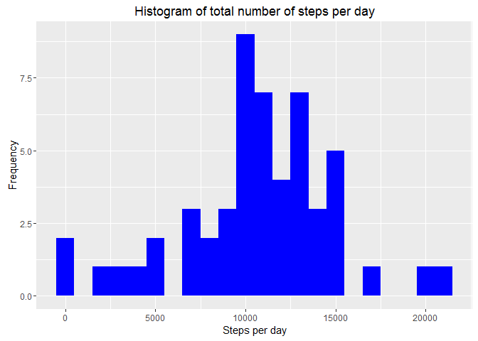
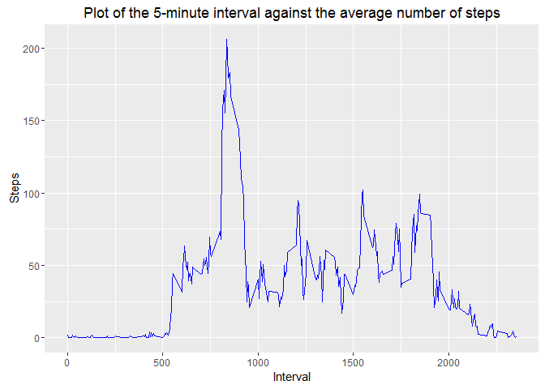
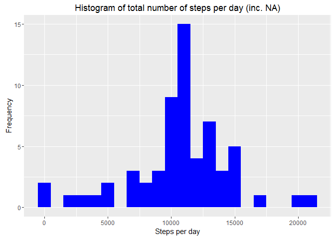
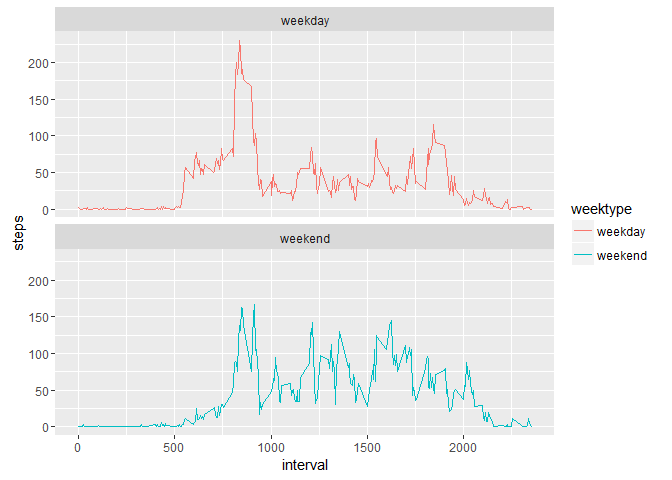

Reproducible Research: Peer Assessment 1
========================================

1. Loading and preprocessing the data
-------------------------------------

Show any code that is needed to:

-   Load the data (i.e. read.csv())
-   Process/transform the data (if necessary) into a format suitable for
    your analysis

<!-- -->

    library(knitr)

    ## Warning: package 'knitr' was built under R version 3.2.3

    knitr::opts_chunk$set(fig.path='figure/')

    library(lubridate)

    ## Warning: package 'lubridate' was built under R version 3.2.3

    library(dplyr)

    ## 
    ## Attaching package: 'dplyr'

    ## The following objects are masked from 'package:lubridate':
    ## 
    ##     intersect, setdiff, union

    ## The following objects are masked from 'package:stats':
    ## 
    ##     filter, lag

    ## The following objects are masked from 'package:base':
    ## 
    ##     intersect, setdiff, setequal, union

    library(ggplot2)

    ## Warning: package 'ggplot2' was built under R version 3.2.3

    data <- "./activity.csv"
    activity <- read.csv(data, header = TRUE, sep = ",", stringsAsFactors=FALSE)
    activity<-tbl_df(activity)
    activity$date <- ymd(activity$date)

It is assumed that the packages lubridate, dplyr and ggplot2 are all
installed, and the file "activity.csv" exists in the working directory.

2. What is mean total number of steps taken per day?
----------------------------------------------------

For this part of the assignment, you can ignore the missing values in
the dataset.

-   Calculate the total number of steps taken per day
-   If you do not understand the difference between a histogram and a
    barplot, research the difference between them. Make a histogram of
    the total number of steps taken each day
-   Calculate and report the mean and median of the total number of
    steps taken per day

<!-- -->

    total_steps <- activity %>%
          filter(!is.na(steps)) %>%
          group_by(date) %>%
          summarize(steps = sum(steps)) %>%
          print

    ## Source: local data frame [53 x 2]
    ## 
    ##          date steps
    ##        (time) (int)
    ## 1  2012-10-02   126
    ## 2  2012-10-03 11352
    ## 3  2012-10-04 12116
    ## 4  2012-10-05 13294
    ## 5  2012-10-06 15420
    ## 6  2012-10-07 11015
    ## 7  2012-10-09 12811
    ## 8  2012-10-10  9900
    ## 9  2012-10-11 10304
    ## 10 2012-10-12 17382
    ## ..        ...   ...

    ggplot(total_steps, aes(x = steps)) +
      geom_histogram(fill = "blue", binwidth = 1000) +
      labs(title = "Histogram of total number of steps per day", x = "Steps per day", y = "Frequency")

<!-- -->

    mean<-mean(total_steps$steps, na.rm = TRUE)
    median<-median(total_steps$steps, na.rm = TRUE)
    paste("The mean of the total number of steps taken per day is",mean)

    ## [1] "The mean of the total number of steps taken per day is 10766.1886792453"

    paste("The median of the total number of steps taken per day is",median)

    ## [1] "The median of the total number of steps taken per day is 10765"

The mean of the total number of steps taken per day is 10766.19. The
median of the total number of steps taken per day is 10765.

3. What is the average daily activity pattern?
----------------------------------------------

-   Make a time series plot (i.e. type = "l") of the 5-minute interval
    (x-axis) and the average number of steps taken, averaged across all
    days (y-axis)
-   Which 5-minute interval, on average across all the days in the
    dataset, contains the maximum number of steps?

<!-- -->

    ave_interval <- activity %>%
      filter(!is.na(steps)) %>%
      group_by(interval) %>%
      summarize(steps = mean(steps)) %>%
      print

    ## Source: local data frame [288 x 2]
    ## 
    ##    interval     steps
    ##       (int)     (dbl)
    ## 1         0 1.7169811
    ## 2         5 0.3396226
    ## 3        10 0.1320755
    ## 4        15 0.1509434
    ## 5        20 0.0754717
    ## 6        25 2.0943396
    ## 7        30 0.5283019
    ## 8        35 0.8679245
    ## 9        40 0.0000000
    ## 10       45 1.4716981
    ## ..      ...       ...

    ggplot(ave_interval, aes(x=interval, y=steps)) +
      geom_line(color = "blue") +
      labs(title = "Plot of the 5-minute interval against the average number of steps", y = "Steps", x = "Interval")

<!-- -->

    max<-ave_interval[which.max(ave_interval$steps),]
    paste("The 5-minute interval with the maximum number of steps is",max$interval)

    ## [1] "The 5-minute interval with the maximum number of steps is 835"

The 5-minute interval with the maximum number of steps is 835.

4. Imputing missing values
--------------------------

Note that there are a number of days/intervals where there are missing
values (coded as NA). The presence of missing days may introduce bias
into some calculations or summaries of the data.

-   Calculate and report the total number of missing values in the
    dataset (i.e. the total number of rows with NAs)
-   Devise a strategy for filling in all of the missing values in the
    dataset. The strategy does not need to be sophisticated. For
    example, you could use the mean/median for that day, or the mean for
    that 5-minute interval, etc.
-   Create a new dataset that is equal to the original dataset but with
    the missing data filled in.
-   Make a histogram of the total number of steps taken each day and
    Calculate and report the mean and median total number of steps taken
    per day. Do these values differ from the estimates from the first
    part of the assignment? What is the impact of imputing missing data
    on the estimates of the total daily number of steps?

<!-- -->

    missing<-sum(is.na(activity))
    paste("The total number of missing values in the dataset is",missing)

    ## [1] "The total number of missing values in the dataset is 2304"

    nas <- is.na(activity$steps)
    ave_interval <- tapply(activity$steps, as.factor(activity$interval), mean, na.rm=TRUE)
    activity$steps[nas] <- ave_interval[as.character(activity$interval[nas])]

    total_steps <- activity %>%
          group_by(date) %>%
          summarize(steps = sum(steps)) %>%
          print

    ## Source: local data frame [61 x 2]
    ## 
    ##          date    steps
    ##        (time)    (dbl)
    ## 1  2012-10-01 10766.19
    ## 2  2012-10-02   126.00
    ## 3  2012-10-03 11352.00
    ## 4  2012-10-04 12116.00
    ## 5  2012-10-05 13294.00
    ## 6  2012-10-06 15420.00
    ## 7  2012-10-07 11015.00
    ## 8  2012-10-08 10766.19
    ## 9  2012-10-09 12811.00
    ## 10 2012-10-10  9900.00
    ## ..        ...      ...

    ggplot(total_steps, aes(x = steps)) +
      geom_histogram(fill = "blue", binwidth = 1000) +
      labs(title = "Histogram of total number of steps per day (inc. NA)", x = "Steps per day", y = "Frequency")

<!-- -->

    mean<-mean(total_steps$steps, na.rm = TRUE)
    median<-median(total_steps$steps, na.rm = TRUE)
    paste("The mean of the total number of steps taken per day is",mean)

    ## [1] "The mean of the total number of steps taken per day is 10766.1886792453"

    paste("The median of the total number of steps taken per day is",median)

    ## [1] "The median of the total number of steps taken per day is 10766.1886792453"

The mean number of steps for each interval is determined using the
*tapply* command. Any entries that are NA in the original dataset are
replaced by the corresponding entry in this mean-valued dataset.

The mean of the total number of steps taken per day is 10766.19. The
median of the total number of steps taken per day is 10766.19.

Comparing with the previous results, the mean and median are now
identical and differ slightly to the previous median value. The
histograms differ, but are of similar form.

5. Are there differences in activity patterns between weekdays and weekends?
----------------------------------------------------------------------------

For this part the weekdays() function may be of some help here. Use the
dataset with the filled-in missing values for this part.

-   Create a new factor variable in the dataset with two levels -
    "weekday" and "weekend" indicating whether a given date is a weekday
    or weekend day.
-   Make a panel plot containing a time series plot (i.e. type = "l") of
    the 5-minute interval (x-axis) and the average number of steps
    taken, averaged across all weekday days or weekend days (y-axis).
    See the README file in the GitHub repository to see an example of
    what this plot should look like using simulated data.

<!-- -->

    activity_wd <- mutate(activity, weektype = ifelse(weekdays(activity$date) == "Saturday" | weekdays(activity$date) == "Sunday", "weekend", "weekday"))
    activity_wd$weektype<-as.factor(activity_wd$weektype)

    wd_interval<- activity_wd %>%
          group_by(interval, weektype) %>%
          summarize(steps = mean(steps)) %>%
          print

    ## Source: local data frame [576 x 3]
    ## Groups: interval [?]
    ## 
    ##    interval weektype       steps
    ##       (int)   (fctr)       (dbl)
    ## 1         0  weekday 2.251153040
    ## 2         0  weekend 0.214622642
    ## 3         5  weekday 0.445283019
    ## 4         5  weekend 0.042452830
    ## 5        10  weekday 0.173165618
    ## 6        10  weekend 0.016509434
    ## 7        15  weekday 0.197903564
    ## 8        15  weekend 0.018867925
    ## 9        20  weekday 0.098951782
    ## 10       20  weekend 0.009433962
    ## ..      ...      ...         ...

    ggplot(wd_interval, aes(x = interval, y=steps, color = weektype)) +
      geom_line() + facet_wrap(~weektype, ncol = 1, nrow=2)

<!-- -->
